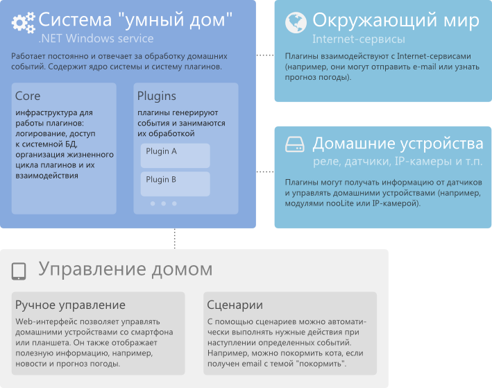

# ThinkingHomme

**ThinkingHome &mdash; управление домом по сценариям и через web-интерфейс.**

ThinkingHome - это программа (.NET Windows service), с помощью которой вы можете организовать на своем компьютере управляющий центр умного дома. Сервис постоянно запущен на компьютере - он занимается обработкой событий и выполнением сценариев. Вы можете работать с сервисом через веб-интерфейс.

### Управление по сценариям

Система позволяет управлять домом по сценариям, т.е. назначать на различные события в доме произвольную логику по управлению домашними устройствами. Событие - это срабатывание датчика, сигнал с таймера, нажатие на кнопку или, например, получение сообщения в твиттере. При возникновении события запускаются сценарии - небольшие программы, которые могут управлять домашними устройствами. Например, сценарий может проверить температуру в доме и включить теплый пол, если нужно.

### Управление через веб-интерфейс

Веб-интерфейс доступен с любого устройства (компьютера, планшета или смартфона), подключенного к вашей домашней сети. Он отображает информацию, нужную вам в повседневной жизни (например, расписание автобусов или прогноз погоды), а также дает возможность удаленно управлять вашим домом или менять настройки системы.

## Как это работает?

## Плагины

Система ThinkingHome имеет систему плагинов. При помощи плагинов можно расширять список возможных событий в системе (например, генерировать событие при срабатывании датчика движения) и взаимодействовать с любыми устройствами (например, с системой nooLite) или сервисами (например, с сервером электронной почты).

По большому счету, весь функционал системы находится в плагинах, а сервис содержит только инфраструктуру для их работы. Он обеспечивает загрузку плагинов и организует их жизненный цикл, а также предоставляет им средства для логирования, для работы с внутренней БД, для взаимодействия друг с другом (плагины могут подписываться на события друг друга и вызывать команды друг друга).

Если вам не хватает в системе каких-то возможностей или нужно работать с нестандартными устройствами (например, с собранными самостоятельно на основе Arduino) - просто напишите собственный плагин для системы. Плагины могут работать с любыми устройствами и сервисам, с которыми может работать компьютер. Писать собственные плагины [очень просто](doc/PLUGINS.md)! 

## Что дальше?

Перейдите в раздел [С чего начать](doc/GETTING-STARTED.md) в котором рассказано, как установить систему, как работать с веб-интерфейсом  и как написать простой сценарий.
