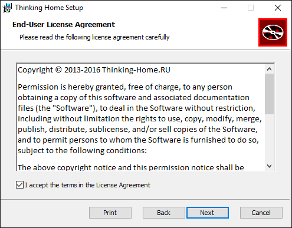
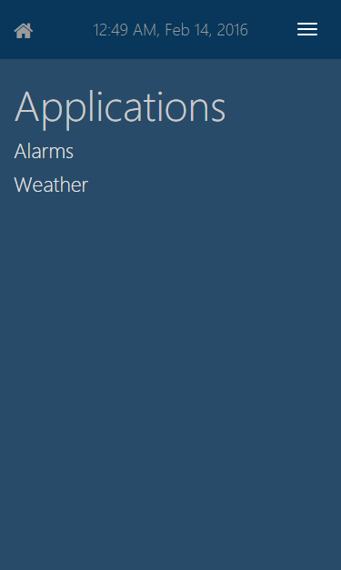
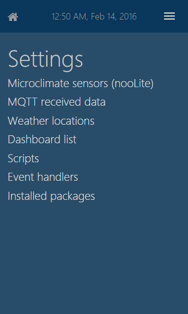
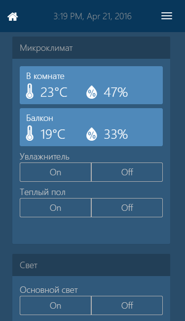
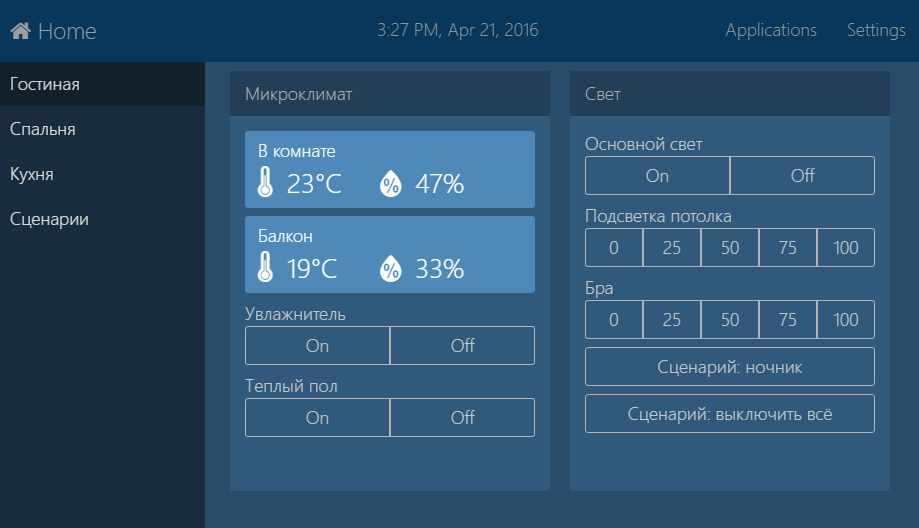
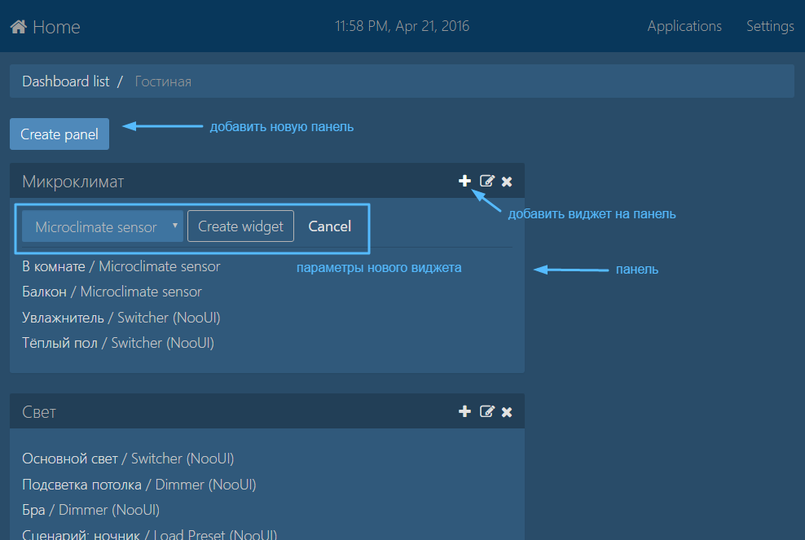
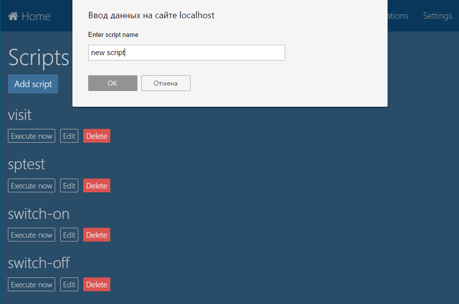
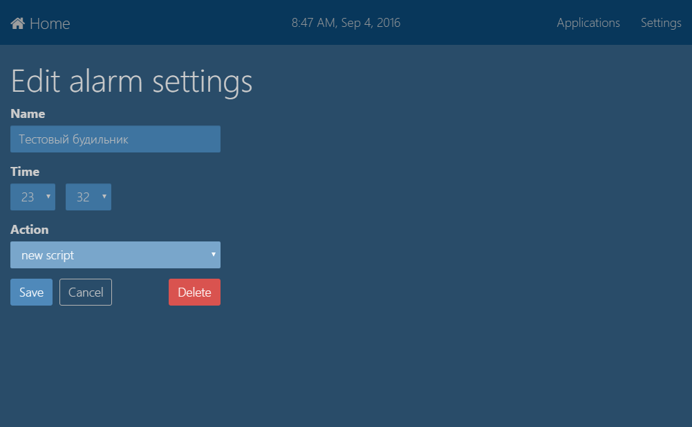

# С чего начать

## Установка

Для работы системы понадобится компьютер с **ОС Windows 7 или более поздней версии**. Также **необходимо [скачать](http://www.microsoft.com/en-us/download/details.aspx?id=40779) и установить .NET Framework 4.5**.

После этого скачайте и запустите [инсталлятор](#) котрый установит *ThinkingHome.System* на ваш компьютер. Во время установки можно выбрать язык (русский/английский) и порт для встроенного веб-сервера. Сервис будет установлен в папку `C:\Program Files\ThinkingHome\service`.




После установки на рабочем столе появится ярлык *ThinkingHome Control Panel*, при запуске которого в браузере откроется web-интерфейс системы. Вы можете также открыть web-интерфейс системы, набрав в адресной строке браузера <http://localhost:41831>, где `localhost` - это название или IP-адрес вашего компьютера, а `41831` &mdash; номер порта, указанный во время установки.

## Организация веб-интерфейса

Интерфейс управления домом состоит из разделов. Плагины могут добавлять в интерфейс собственные разделы (любой плагин может добавить любое количество разделов). Разделы поделены на 2 группы: *пользовательские* (разделы, с которыми пользователи работают в повседневной жизни, например, «прогноз погоды» и «будильники») и *системные* (различные настройки, например, раздел домашних сценариев).

Кроме страниц разделов веб-интерфейс имеет три специальных страницы:
- список пользовательских разделов;
- список системных разделов;
- рабочий стол (стартовая страница).

### Списки разделов

При установке новых плагинов разделы, содержащиеся в них, автоматически добавляются либо в пользовательский список разделов, либо в системный. Ссылки на списки разделов находятся в правом верхнем углу экрана и доступны постоянно. *Applications* - пользовательские разделы, *Settings* - системные. На маленьких экранах ссылки перемещаются в навигационное меню (обозначено пиктограммой: <span class="fa fa-bars"></span>).




### Рабочие столы

На рабочем столе находятся виджеты — элементы управления, которые отображают полезную информацию или позволяют выполнить какие-либо действия.

Рабочих столов может быть несколько. Например, можно сделать отдельный рабочий стол для каждой комнаты в доме. Если рабочих столов больше одного, слева будет отображаться меню, с помошью которого можно переключаться между ними.

Рабочие столы открываются по основному  адресу приложения (т.е. по адресу <http://localhost:41831>). Также в любое время вы можете перейти на рабочий стол, кликнув на пиктограмму <span class="fa fa-home"></span> в левом верхнем углу экрана. 

Стартовая страница (и весь остальной интерфейс тоже) корректно отображается как на больших экранах, так и на небольших экранах мобильных устройств. На маленьких экранах меню переключения между рабочими столами перемещается в в навигационное меню (обозначено пиктограммой: <span class="fa fa-bars"></span>).





Изменяя настройки системы, вы можете создавать рабочие столы и размещать на них нужные вам виджеты. Для изменения настроек рабочих столов перейдите в раздел *Settings &rarr; Dashboard list*.

На рабочем столе можно разместить несколько панелей. Каждая панель будет отображаться в виде отдельного блока. При добавлении панели нужно указать ее название.

На панель можно добавить виджеты. Например, можно добавить виджеты управления освещением и виджет, показывающий температуру в комнате. 

При добавлении виджета нужно указать его название и значения его параметров. Например для виджета управления освещением нужно указать группу светильников, которой нужно управлять, а для виджета, отображающего температуру, нужно указать датчик микроклимата, с которого брать информацию.

Устанавливая плагины, можно добавлять в систему новые типы виджетов.



## Написание простого сценария

Сценарии - это небольшие программы, которые выполняют некоторые действия в вашем доме. Сценарии пишутся на языке JavaScript, но выполняются не в браузере, а на стороне сервиса автоматизации (т.е. внутри сервиса, установка которого описана чуть выше). Внутри сценариев доступен программный интерфейс (API), с помощью котрого вы можете управлять домашними устройствами или взаимодействовать с интернет-сервисами. Весь этот API реализован в плагинах умного дома - устанавливая новые плагины, вы можете расширять доступный API новыми командами.

Давайте попробуем написать простой сценарий. Это очень просто.

Нажмите на ссылку *Settings* в правом верхнем углу веб-интерфейса, чтобы открыть список системных разделов и выберите там раздел *Scripts*, чтобы открыть список сценариев в системе. Нажмите кнопку *Add script* и введите название нового сценария. 



Давайте запишем сообщение в лог и включим свет в комнате при помощи адаптера nooLite. В открывшийся редактор сценариев скопируйте следующий код:

```js
// пишем в лог строку "hello, world!"
host.logInfo("hello, world!");

// включаем свет в 3 канале адаптера
host.executeMethod("nooliteSetLevel", 3, 100);

```

Сохраняем сценарий и видим, что он добавился в общий список. Чтобы запустить его, нажмите кнопку "Run manually". При нажатии этой кнопки вы увидите сообщение "The script [script name] has been executed" и, если к компьютеру был подключен [USB адаптер nooLite](http://thinking-home.ru/category/noolite-usb-adapters.aspx), то светильники, привязанные к 3-му каналу адаптера будут включены. После этого идем в папку с логами `C:\Program Files\ThinkingHome\service\Logs` и смотрим файл `2014-10-08-ThinkingHome.Plugins.Scripts.ScriptsPlugin.log` (вместо "2014-10-08" будет сегодняшняя дата) - там должна быть надпись

```
2014-10-08 21:43:11.7457, Info, hello, world!
```

(естественно, дата и время в начале строки будут другими).

## Запуск сценария по расписанию

Среди плагинов, установленных по умолчанию, есть плагин "будильники", позволяющий в нужное время включить сигнал будильника или запустить сценарий. Давайте настроим автоматический запуск нашего сценария в нужное время.

Нажмите на ссылку "Applications" в правом верхнем углу веб-интерфейса системы, чтобы открыть список пользовательских разделов. Выберите там раздел "Alarms" (будильники), чтобы открыть весь список будильников в системе, и добавьте новый будильник, нажав на кнопку "Add".



В настройках будильника укажите для него название, время срабатывания и действие, которое нужно выполнить. В выпадающем списке действий будут отображаться все имеющиеся сценарии и специальный пункт *<PLAY SOUND>* (если выбрать его, то в заданное время заиграет такая дебильная бодренькая музыка). Выберите в качестве выполняемого действия сценарий, который мы создали чуть ранее и сохраните настройки будильника. Проверьте, что выбранный сценарий запустился в нужное время.

## Что дальше?

Мы рассмотрели установку системы, организацию ее веб-интерфейса и написание простых сценариев. В разделе [Сценарии](SCRIPTS.md) вы сможете узнать подробнее о сценариях.
