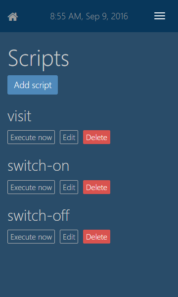
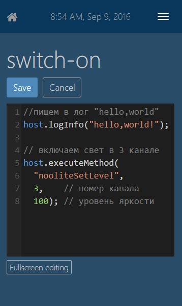
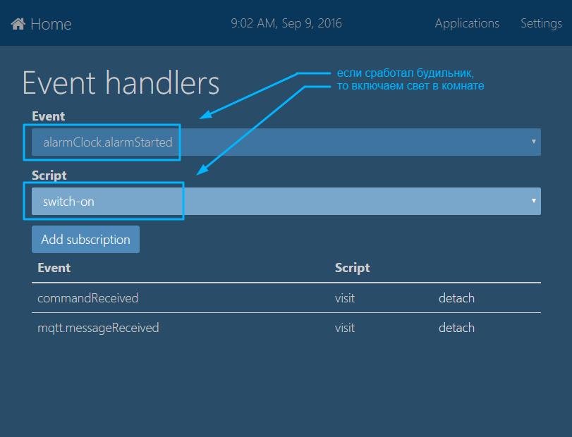

# Сценарии

Сценарии - это небольшие программы, которые могут управлять домашними устройствами, вызывая команды плагинов. Сценарий может быть выполнен при наступлении определенного события в системе или может быть вызван из другого сценария. Возможность работы со сценариями обеспечивает специальный плагин `ThinkingHome.Plugins.Scripts`.

Для написания сценариев используется язык Java Script. В сценариях доступны все стандартные средства языка, а также объект `host`, предоставляющий доступ к инфраструктуре сервиса автоматизации и возможностям плагинов. С его помощью можно писать сообщения в лог, вызывать команды плагинов и запускать другие сценарии.

## Создание и редактирование

Добавлять/удалять сценарии и редактировать их текст можно через web-интерфейс. Для просмотра списка всех сценариев выберите в разделе `Settings` пункт `Scripts`. Для начала редактирования сценария книклите кнопку `Edit` рядом с его названием. Для запуска сценария (например, чтобы проверить его работу) кликните кнопку `Execute now`.





## Подписка на события

В системе можно настроить автоматический запуск сценариев при наступлении определенных событий. Например, срабатывание датчика движения - это событие, нажатие на кнопку - тоже. События генерируются плагинами.

Информация о том, какой сценарий должен быть выполнен при наступлении какого события, хранятся в системной БД. Добавить или удалить обработчики событий можно в разделе `Settings` &rarr; `Event handlers`.



События могут иметь параметры, значения которых будут доступны внутри запускаемых сценариев. Напрмиер, событие "получена команда от адаптара nooLite RX2164" будет иметь параметры: `тип команды`, `номер канала`, `данные`. Пример обработки параметров сценария, переденных извне, будет приведен позже.
	
Обратите внимание, в списке событий для подписки отображаются не все события плагинов, а только те, к которым плагины разрешили доступ для сценариев. Более подробную информацию о доступных событиях смотрите в документации к плагинам. 

## Логирование

Логирование - важный инструмент, т.к. с его помощью можно получить информацию о ходе выполнения сценариев (например, это может быть нужно при их отладке). Данные, которые логируются в сценариях, сохраняются в лог плагина `ThinkingHome.Plugins.Scripts`.

Для записи в лог информационных сообщений используйте метод `host.logInfo`. 

```
host.logInfo("Hello, world!");
```

Для записи в лог сообщения об ошибке используйте метод `host.logError`.

```
host.logError("plugin is not found!")
```

Оба метода в качестве первого параметра принимают текст сообщения, а в качестве последующих параметров - его аргументы. Места добавления аргументов в сообщении можно задать при помощи синтаксиса `{1}`, где "1" - это номер аргумента (номера начинаются с 0, аналогично методу string.Format в C#).

Например, добавить в сообщение значение переменных x и y, можно примерно так:	

```
host.logError("{0} + {1} = {2}", x, y, x + y);
``` 

Если x = 2 и y = 7, то в лог будет записана строка "2 + 7 = 9".

## Вызов методов плагинов из сценариев

Плагины могут разрешать сценариям выполнять некоторые свои методы. При этом плагины определяют `имена` для методов, доступных сценариям. Для вызова метода плагина из сценария используйте команду `executeMethod` объекта `host`. В качестве первого аргумента необходимо передать `имя метода плагина`, а в качестве последующих аргументов - его параметры.

Например, чтобы при помощи usb-адаптера nooLite выключить свет в 3 канале, нужно использовать примерно такой скрипт:

```
host.executeMethod("nooliteSetLevel", 3, 0);
```

Список методов плагинов, которые можно использовать в сценариях, смотрите в документации к плагинам.

## Запуск других сценариев

Иногда при выполнении сценария может потребоваться запустить другой сценарий. Например, сценарий, присматривающий за домом в ваше отсутствие, может запускать сценарий *полива цветов* и сценарий *имитации присутствия* (имитация присутствия - в комнатах на некоторое время иногда включается свет, как будто дома кто-то есть).

Для запуска сценария используйте метод `runScript` объекта `host`. В качестве первого аргумента необходимо передать название запускаемого сценария. Остальные аргументы будут переданы в запускаемый сценарий как входные параметры.

Например, следующий код запустит сценарий с именем *myScript* и передаст ему 3 параметра: `'qwrqwrqwr22222'` (строка), `12355` (целое число), `true` (логическое значение).

```
host.runScript('myScript', 'qwrqwrqwr22222', 12355, true);
```

## Обработка параметров

Как мы видели выше, при запуске сценария ему могут быть переданы дополнительные параметры. Внутри сценария можно получить их значения через массив `arguments`. Ниже приведен пример сценария, который записывает в лог значения всех переданных ему параметров.

```
host.logInfo("length = {0}", arguments.length);

for(var i = 0; i < arguments.length; i++)
{
    host.logInfo("arguments[{0}] = {1}", i, arguments[i]);
}
```

## Что дальше?

Мы подробно рассмотрели написание сценариев и настройку их автоматического запуска при возникновении определенных событий. В разделе [Создание плагинов](PLUGINS.md) вы узнаете, как легко писать собственные плагины, с помощью которых вы можете добавить в систему новые события или новые команды для сценариев.
