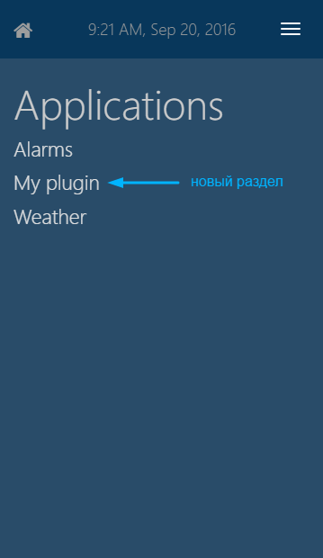
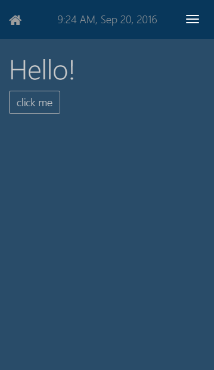
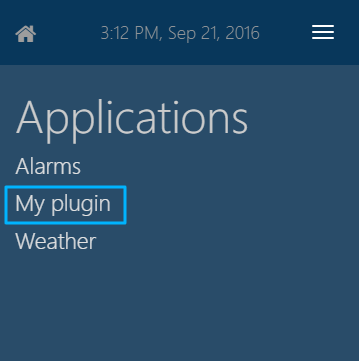
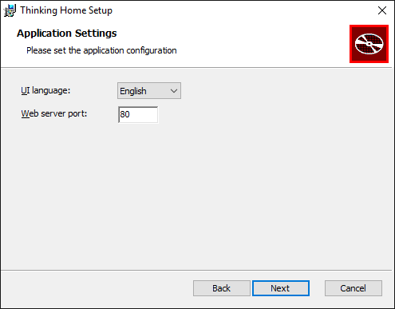
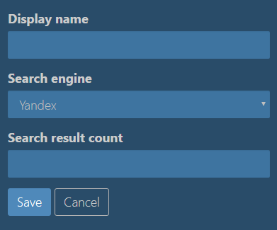

# UI (пользовательский интерфейс) для плагинов

Веб-интерфейс системы реализован в отдельном плагине *WebUIPlugin*. Плагин *WebUIPlugin* также содержит инфраструктуру, с помощью которой другие плагины могут добавлять собственные разделы в веб-интерфейс системы.

Технически, веб-интерфейс представляет собой модульное одностраничное приложение на основе [marionette.js](http://marionettejs.com). Загрузка модулей происходит по мере необходимости с помощью [require.js](http://requirejs.org). Для визуальной части используется кастомизированная сборка [Twitter Bootstrap](http://getbootstrap.com).

## Быстрый старт

Добавить новый раздел в веб-интерфейс очень просто. Создайте проекте своего плагина файл с расширением `.js` и добавьте туда следующее содержимое:

```js
define(              // определяем новый модуль нашего приложения
    ['lib'],         // список зависимостей нашего модуля
    function (lib) {	// функция инициализации нашего модуля 
        
        // шаблон содержимого: заголовок и кнопка
        var myTemplate = lib.handlebars.compile(
            '<h1>Hello!</h1><input type="button" class="btn btn-default" value="click me" />');

        // описываем представление
        var myView = lib.marionette.ItemView.extend({
            // шаблон
            template: myTemplate,
            // события
            triggers: { 'click input': 'my-event' }
        });

        // описываем новый раздел
        var mySection = lib.common.AppSection.extend({
            // действия при открытии страницы
            start: function () {
                // создаем экземпляр представления
                var view = new myView();
				
                // подписываемся на события
                this.listenTo(view, 'my-event', function() {
                    alert('I\'m happy!');
                });
				
                // отображаем представление пользователю
                this.application.setContentView(view);
            }
        });

        // описанный новый раздел - является содержимым нашего модуля
        return mySection;
    });

```

Таким образом, мы только-что описали новый раздел. Как можно понять из комментариев в коде, мы задали для нового раздела шаблон содержимого (заголовок и кнопка), определили событие с именем `"my-event"` (которое возникает при клике на кнопку) и добавили для этого события обработчик, отображающий сообщение пользователю.

Теперь добавьте своему плагину атрибут `ThinkingHome.Plugins.WebUI.Attributes.AppSection` и передайте ему в параметрах название и тип раздела, а также путь к созданному js файлу в ресурсов DLL и желаемый URL для файла.

```csharp
[AppSection(
    "My plugin",             // название рездела 
    SectionType.Common,      // тип раздела (Common/System) 
    "/my-plugin/my-file.js", // URL для js-файла с реализацией интерфейса 
    "ThinkingHome.Plugins.MyPlugin.Resources.my-file.js")] // путь к js-файлу раздела в ресурсах DLL
```

Соберите проект и перезапустите приложение. В списке пользоваательских разделов должен появиться новый пункт *My plugin*. Если нажмете на него, увидите заголовок и кнопку, которые мы добавили в шаблон. При клике на кнопку должен отобразиться alert.




Теперь обо всем подробнее...

## Добавление нового раздела

Любая *страница* веб-интерфейса системы - это небольшая программа на языке JavaScript. Она описывает, что именно должен видеть пользователь на экране и какие действия должны быть выполнены, когда пользователь взаимодействует с элементами интерфейса.

Для добавления нового раздела в систему необходимо в проекте вашего плагина создать js файл, который будет содержать js-код раздела. Далее необходимо настроить загрузку созданного js-файла в браузер. Для этого поместите файл в ресурсы DLL и задайте URL для файла.

Чтобы поместить файл в ресурсы DLL, в свойствах файла укажите для параметра *Build action* значение *EmbeddedResource*.

Для того, чтобы назначить файлу URL, пометьте свой плагин атрибутом `ThinkingHome.Plugins.WebUI.Attributes.JavaScriptResource` из сборки `ThinkingHome.Plugins.WebUI`. Он унаследован от `ThinkingHome.Plugins.Listener.Attributes.HttpEmbeddedResourceAttribute` и устанавливает для ответа правильный content type. Самый простой способ подключить библиотеку `ThinkingHome.Plugins.WebUI` в свой проект - набрать в консоли Nuget Package Manager `Install-Package ThinkingHome.Plugins.WebUI`.

```csharp
[Plugin]
[JavaScriptResource(
    "/my-plugin/my-file.js", // желаемый URL файла 
    "ThinkingHome.Plugins.MyPlugin.Resources.my-file.js")] // путь к файлу в ресурсах DLL
public class MyPlugin : PluginBase
{
	...
}   
```

Плагин `ThinkingHome.Plugins.WebUI` предоставляет также специальный атрибут `ThinkingHome.Plugins.WebUI.Attributes.AppSection`, с помощью которого вы можете автоматически добавить свой раздел в меню системных или пользовательских разделов. Просто используйте атрибут `[AppSection]` вместо атрибута `[JavaScriptResource]`.

```csharp
[Plugin]
[AppSection("My plugin",     // название рездела
    SectionType.Common,      // тип раздела
    "/my-plugin/my-file.js", // URL
    "ThinkingHome.Plugins.MyPlugin.Resources.my-file.js")]
public class MyPlugin : PluginBase
{
    ...
}
```

Кроме желаемого URL и пути к файлу в ресурсах DLL, для атрибута `[AppSection]` необходимо указать два дополнительных параметра: название раздела и его тип (пользовательский/системный). После этого ссылка на раздел автоматически добавится в нужный список разделов.



## Клиентская часть

Веб-интерфейс загружает разделы через [require.js](http://requirejs.org) по мере необходимости. Чтобы файл с кодом раздела автоматически подгрузился в браузер, опишите раздел в виде отдельного модуля *require.js* (для этого используйте глобальную функцию `define`).

```js
define(['lib'], function (lib) {
    var module = lib.common.AppSection.extend({
        start: function () {
            alert("module started!");
        },
        onBeforeDestroy: function() {
            alert("module finished!");
        }
    });

    return module;
});
```

 Как видите, функция `define` принимает два параметра: массив зависимостей и функцию инициализации модуля.

**Массив зависимостей** содержит [имена модулей](#modules), от котрых зависит ваш модуль. Каждый элемент списка зависимостей будет передан как входной параметр в функцию инициализации вашего модуля.

В примере указана только одна зависимость: `lib` - это название специального модуля, который содержит библиотеки общего назначения ([jQuery](http://jquery.com), [underscore](http://underscorejs.org), [backbone.js](http://backbonejs.org), [marionette.js](http://marionettejs.com) и другие).

**Функция инициализации** будет вызвана один раз, сразу после того, как  загрузится файл с кодом вашего модуля. Она должна возвращать объект, представляющий ваш модуль. Именно этот объект получат другие модули, если укажут ваш модуль в списке зависимостей.

Чтобы ваш модуль мог быть использован веб-интерфейсом, необходимо, унаследовать его (с помощью функции `extend`) от объекта `AppSection` из модуля `lib.common`. `AppSection` уже содержит некоторый API, нужный для работы модуля в веб-интерфейсе системы. Вы можете переопределить методы `AppSection` и добавить в них нужное поведение.

В приведенном выше примере переопределен метод `start`, который автоматически вызывается, когда пользователь хочет открыть ваш раздел. Как видите, в примере внутри метода `start` вызывается функция alert. Т.е. при открытии раздела содержимое на экране не поменяется, просто отобразится сообщение "module started!".

Таким образом, когда пользователь нажимает на ссылку перехода в какой-либо раздел, происходит следующее:

- система загружает js-файл раздела при помощи require.js;
- вызывается функция инициализации модуля;
- используя в качестве прототипа объект, полученный из функции инициализации, создается экземпляр модуля;
- у созданного экземпляра модуля вызывается метод `start`.

Если необходимо выполнить какие-то действия при окончании работы модуля, переопределите метод `onBeforeDestroy` - он будет автоматически вызван перед уничтожением каждого экземпляра модуля (например, при переходе пользователя из вашего раздела в другой раздел).

## Отображение содержимого страницы

Для отображения данных в системе используются *представления* (views) из *marionette.js*. Представление - это специальный объект, который знает, как отобразить содержимое страницы и генерирует события при взаимодействии пользователя с элементами интерфейса.

Разметка страницы генерируется по шаблонам с помощью шаблонизатора [handlebars](http://handlebarsjs.com).

Чтобы отобразить пользователю содержимое страницы, сначала опишите прототип предствления и укажите для него нужный шаблон. После этого создайте экземпляр представления и добавьте его на страницу.

Чтобы описать прототип представления, унаследуйтесь от объекта `ItemView` из модуля `lib.marionette` (как и раньше, с помощью функции `extend`). Задайте шаблон в поле `template`. В качестве шаблона нужно передать результат функции `compile` из модуля `lib.handlebars`. Ознакомьтесь с документацией по [Marionette.ItemView](http://marionettejs.com/docs/v2.4.7/marionette.itemview.html) и шаблонизатору [handlebars](http://handlebarsjs.com).

Создайте экземпляр представления, вызвав описанный вами прототип как конструктор (через `new`). После этого добавьте созданный экземпляр представления на страницу с помощью метода `setContentView` объекта `this.application`. 

```js
define(['lib'], function (lib) {
    // описываем представление
    var myView = lib.marionette.ItemView.extend({
        // шаблон содержимого: заголовок и кнопка
        template: lib.handlebars.compile(
            '<h1>Hello!</h1><input type="button" class="btn btn-default" value="click me" />'),
        // ...
        // другие элементы представления: вспомогательные методы, события и т.д.
    });

    var module = lib.common.AppSection.extend({
        start: function () {
            // создаем экземпляр представления
            var view = new myView();
            // отображаем представление пользователю
            this.application.setContentView(view);
        }
    });

    return module;
});
```

В методе `start` и других методах вашего модуля `this` содержит ссылку на текущий экземпляр вашего модуля, а `this.application` содержит ссылку на специальный модуль `application/core/app`. Он предоставляет API для взаимодействия вашего модуля с ядром веб-приложения. Например, с его помощью можно отобразить представление на экране или перейти в другой раздел.


## Отображение данных на странице

Информация появляется в модуле из какого-либо источника данных (например данные могут быть получены с сервера или введены пользователем). Откуда бы ни были получены данные, в модуль они попадают в виде объектов JavaScript. В следующем примере мы не будем рассматривать процесс получения данных и просто создадим нужный объект внутри приложения.

```js
...
start: function () {
    var people = {
        id: 123,
        name: 'Иван',
        surname: 'Петров'
    };

    var model = new lib.backbone.Model(people);
    ...
}
```

В примере мы присвоили в переменную `people` объект с информацией о человеке. После этого мы создали экземпляр модели - специального объекта, унаследованного от `lib.backbone.Mode`. Модель — это обертка над данными, добавляющая удобные средства работы с ними. Например, с помощью модели вы можете указать для полей значения по умолчанию или можете автоматически выполнять нужные действия при изменении значений полей.

В нашем веб-интерфейсе используются модели из библиотеки Backbone.js. Вы можете узнать о них подробнее в [документации Backbone.js](http://backbonejs.org/#Model).

При создании экземпляра представления вы можете передать ему параметр `model` и указать в качестве его значения экземпляр модели с нужными данными. Также вы можете указать в шаблоне места, куда нажно вставить значения полей вашей модели. При отображении на странице в нужные места будут подставлены нужные значения.

```js
// описываем представление
var peopleView = lib.marionette.ItemView.extend({
    // в шаблоне указываем места для подстановки значений полей
    // (названия полей в двойных фигурных скобках)
    template: lib.handlebars.compile(
        '<ul data-people-id="{{id}}"><li>name: {{name}}</li><li>surname: {{surname}}</li></ul>')
});

start: function () {
    ...
    var myModel = new lib.backbone.Model(...);
    ...
    // создаем экземпляр представления
    var view = new peopleView({ model: myModel });
    
    // отображаем представление пользователю
    this.application.setContentView(view);
}
```
## Отображение коллекций объектов

Если вам нужно отобразить на странице список однотипных элементов, вместо `lib.backbone.Model` вам потребуется другой тип моделей — `lib.backbone.Collection`. Экземпляр `lib.backbone.Collection` создается точно так же, как и экземпляр `lib.backbone.Model`, но в конструктор нужно передать не отдельный объект, а массив объектов. При этом каждый элемент коллекции будет являться экземпляром `lib.backbone.Model`.

```js
var items = [
    { id: 1, name: 'Lev', surname: 'Tolstoy' },
    { id: 2, name: 'Ivan', surname: 'Turgenev' },
    { id: 3, name: 'Nikolay', surname: 'Gogol' },
    { id: 4, name: 'Alexander', surname: 'Pushkin' }
];
	
var model = new lib.backbone.Collection(items);
...
```

В приведенном примере мы сформировали массив объектов, каждый из которых имеет поля `id`, `name`, `surname`. Далее мы создали экземпляр `lib.backbone.Collection` — модель для нашего нашего массива. *Backbone.Collection* содержит средства для удобной работы с объектами коллекции. Например, мы легко можем задать порядок сортировки и при обращении к элементам коллекции они будут выдаваться в нужном порядке.

```js
...
var collection = new lib.backbone.Collection(items);
    collection.comparator = 'surname';
		
    collection.sort();
    collection.each(function(obj) {
        console.log('%s %s', obj.get('name'), obj.get('surname'));
    });
		
// будет выведено по фамилии в алфавитном порядке: 
// Nikolay Gogol, Alexander Pushkin, Lev Tolstoy, Ivan Turgenev 
```

Для отображения коллекции на странице используйте базовое представление `lib.marionette.CompositeView` ([документациия](http://marionettejs.com/docs/v2.4.7/marionette.compositeview.html)). Кроме шаблона,ему нужно указать прототип представления для отображения элементов коллекци, а также селектор для контейнера, в который они будут добавлены.

```js
// описываем представление для отдельного элемента коллекции
var peopleView = lib.marionette.ItemView.extend({
    // шаблон отображения
    template: lib.handlebars.compile(('{{name}} {{surname}} ({{id}})')
});

var peopleListView = lib.marionette.CompositeView.extend({
    // шаблон отображения
    template: lib.handlebars.compile('<h1>Peoples</h1><div id="list"></div>'),
    // прототип представления отдельного элемента
    childView: peopleView,
    // контейнер, куда будут добавляться элементы
    childViewContainer: '#list'
});
```

При создании экземпляра представления объект с данными (*Backbone.Collection*) нужно поместить в поле `collection`.

```js
var data = new lib.backbone.Collection(...);

var module = {
    start: function () {
        ...
        // создаем экземпляр представления и передаем туда данные (Backbone.Collection)
        var view = new peopleListView({ collection: model });
        // отображаем представление на странице
        this.application.setContentView(view);
    }
};
```

## Макет страницы (layout)

Если страница состоит из нескольких независимых частей, вы можете описать для каждой из них отдельное представление. Чтобы отобразить их вместе на одной странице, вам понадобится еще одно представление специального типа *макет страницы* (layout view). Внутри layout view вы можете описать несколько *областей* (region) и отобразить в каждой из них отдельное представление. 

Например, если на странице должен быть список элементов и панель с условиями фильтрации, то вы можете создать отдельное представление для списка, отдельное представление для панели фильтров и при изменении фильтров обновлять только список (т.е. обновлять только одну из областей страницы).

Для описания *макета страницы* используйте базовое представление `lib.marionette.LayoutView` ([документация](http://marionettejs.com/docs/v2.4.7/marionette.layoutview.html)). Как и для других представлений, для макета нужно задать шаблон отображения. Области для дочерних представлений определяются при помощи параметра `regions`. В качестве его значения необходимо указать объект, каждое поле котрого будет соответствовать отдельному региону страницы. Название поля — это название региона, а значение поля — строка, задающая селектор для DOM элемента, в котором будет отображаться дочернее представление.

Например:

```js
var layoutTemplate = '<div>' +
    '<h1>List items</h1>' +
    '<div id="region-filter"></div>' +
    '<div id="region-list"></div>' +
    '</div>';

// определяем параметры представления
var myLayout = lib.marionette.LayoutView.extend({
    template: lib.handlebars.compile(layoutTemplate),
        regions: {
            filter: '#region-filter',
            list: '#region-list'
        }
    });
```

 Чтобы отобразить внутри региона дочернее представление, необходимо у соответствующего поля макета вызвать метод `show` и передать в него экземпляр дочернего представления.

```js
...
start: function() {
    // создаем экземпляр layout view и добавляем его на страницу
    var layoutView = new myLayout();
    this.application.setContentView(layoutView);

    // создаем экземпляры дочерних представлений
    var filterView = new myFilterView( ... );
    var listView = new myListView( ... );

    // отображаем дочерние представления на странице
    layoutView.filter.show(filterView);
    layoutView.list.show(listView);
}
```

Обратите внимание, в приведенном примере `layoutView.filter` и `layoutView.list` — это названия регионов. В соответствии с указанными параметрами макета страницы, представление `filterView` будет добавлено в блок с *id = "region-filter"* (селектор `"region-filter`), а представление `listView` будет отображаться в блоке с *id = "region-list"* (селектор `#region-filter`). Вместо селекторов по id можно использовать любые другие (например, по css-классу).

## Размещение шаблонов в отдельных файлах

В предыдущем примере мы использовали очень простые шаблоны и разместили их непосредственно в коде (шаблоны в виде строки передавались в функцию `lib.handlebars.compile`). Например:

```js
...
template: lib.handlebars.compile('{{name}} ({{id}})')
...
```

Для небольших шаблонов такой подход довольно удобен, но более сложные шаблоны удобнее будет вынести в отдельные файлы.

- не нужно будет беспокоиться об экранировании кавычек (в отличие от варианта с размещением шаблонов в коде в виде строк);
- будет работать подсветка HTML и автокомплит в IDE;
- глядя на структуру файлов сразу будет понятно, где находятся шаблоны;
- и т.д.

Для подключения шаблонов из отдельных файлов, в первую очередь, нужно поместить файлы с шаблонами в ресурсы плагина и настроить доступ к ним по  HTTP. Для этого необходимо установить для файлов с шаблонами параметр *Build action* = *EmbeddedResource*, пометить класс плагина атрибутом `ThinkingHome.Plugins.Listener.Attributes.HttpEmbeddedResourceAttribute` (нужно добавить отдельный атрибут для каждого файла шаблона). В параметрах атрибута `[HttpEmbeddedResource]` необходимо указать путь к файлу ресурсов и URL, котрый будет использоваться для загрузки файла по протоколу HTTP.

В *стандартных* плагинах файлы шаблонов имеют расширение `.tpl` (соткращение от "template"). Рекомендуем вам использовать это же расширение для ваших шаблонов (хотя это и не обязательно - по большому счету, расширение может быть любым).

Вот пример подключнения шаблона для страницы с прогнозом погоды:

```csharp
[HttpEmbeddedResource(
    "/webapp/weather/forecast.tpl",  // URL для загрузки файла
    "ThinkingHome.Plugins.Weather.Resources.js.forecast.forecast.tpl")]  // путь к файлу в ресурсах плагина
public class WeatherUIPlugin : PluginBase
{
    ...
}
```

Для обращения к файлам шаблонов на стороне клиента необходимо добавить их в список зависимостей модуля в виде `text!<URL файла с шаблоном>`. Содержимое шаблона будет передано как входной параметр (строка) в функцию инициализации модуля.

```js
define(
    ['lib', 'text!myplugin/mytemplate.tpl'],
    function (lib, myTemplate) {

        var myView = lib.marionette.ItemView.extend({
            template: lib.handlebars.compile(myTemplate)
        });

        var module = {
            start: function () {

                var model = ...
                var view = new myView({ model: model });
                this.application.setContentView(view);
            }
        };

        return module;
    });
```

## Размещение кода представлений в отдельных файлах

Если ваш плагин имеет несколько сложных представлений, вполне вероятно, вы захотите разместить их код в отдельном файле. В этом случае найти их будет значительно легче (согласитесь, найти файл в файловой системе проще, чем найти нужный фрагмент в одном большом файле), а также намного удобнее будет работать с кодом (т.к. остальной клиентский код не будет отвлекать ваше внимание). Кроме того, представления обычно имеют зависимости, которые больше нигде не используются (напрмиер, файлы с шаблонами). Очень удобно, когда эти зависимости инкапсулированы в отдельном файле с представлениями.

Для размещения представлений в отдельном файле создайте отдельный модуль для require.js, укажите необходимые зависимости и верните из функции инициализации модуля объект, содержащий ваши представления. Т.к. файл с представлениями не является отдельным разделом системы, наследовать возвращаемый объект от `lib.common.AppSection` не нужно.

В результате должно получиться примерно так:

```js
/*************************************************
 * файл с кодом представлений: my-plugin/views.js *
 *************************************************/

define([
    'lib', 
    'text!myplugin/layout-template.tpl', // общий шаблон страницы
    'text!myplugin/list-template.tpl',   // шаблон для списка объектов
    'text!myplugin/item-template.tpl'    // шаблон для элемента списка
    ],
    function lib, tmplLayout, tmplList, tmplListItem) {

        // описываем наши представления
        var myLayout = lib.marionette.LayoutView.extend({
            template: lib.handlebars.compile(tmplLayout),
            ...
        });
        var myListItemView = lib.marionette.ItemView.extend({
            template: lib.handlebars.compile(tmplListItem),
            ...
        });
        var myListView = lib.marionette.CompositeView.extend({
            template: lib.handlebars.compile(tmplList),
            childView: myListItemView,
            ...
        });

        // возвращаем объект, с помошью которого другие модули
        // будут использовать наши представления
        return {
            layout: myLayout,
            listView: myListView
        };
    });
```

Как и остальные файлы содержащие клиентский код, файл с представлениями необходимо поместить в ресурсы плагина. Также необходимо указать URL для файла, но вместо атрибута `[AppSection]`, который мы использовали для основного модуля, нужно добавить другой атрибут `[JavaScriptResource]` из пространства имен `ThinkingHome.Plugins.WebUI.Attributes`.

В результате должен получиться примерно такой код:

```csharp
[Plugin]
[AppSection("My plugin", SectionType.Common, "/my-plugin/index.js", "ThinkingHome.Plugins.MyPlugin.Resources.index.js")]
[JavaScriptResource("/my-plugin/views.js", "ThinkingHome.Plugins.MyPlugin.Resources.views.js")]
public class MyPlugin : PluginBase
{
    ...
}
```

После этого можно обращаться к модулю с представлениями из основного модуля. Для этого нужно добавить модуль с представлениями в список зависимостей основного модуля (*указать его URL без начального символа "/" и расширения ".js"*), добавить соответствующий входной параметр в его функцию инициализации и обратиться к его полям, содержащим представления.

Пример кода основного модуля:

```js
define(
    ['lib', 'my-plugin/views'],
    function (lib, views) {
        // входной параметр views - это объект, который
        // был возвращен из функции инициализации модуля с представлениями
        var module = {
            start: function () {
				
                var model = ...
                var view = new views.listView({ collection: model });
                this.application.setContentView(view);
            }
        };

        return module;
    });
```

Обратите внимание, мы подключаем только модуль с представлениями. Все файлы, от которых он зависит, будут загружены автоматически, в соответствии с его списком зависимостей.

## Подключение стилей

По умолчанию в приложение уже подключены стили [Twitter Bootstrap](http://getbootstrap.com) и вы можете использовать при верстке css-классы оттуда. Хотя в большинстве случаев стилей из Twitter Bootstrap будет достаточно, скорее всего возникнут ситуации, когда нужно подключить дополнительные файлы со стилями. Например, это может потребоваться, если у вас много css-классов (и вы хотите вынести их в отдельный файл) или при подключении внешних библиотек, имеющих собственные стили.

Подключить дополнительные файлы стилей очень легко. Необходимо поместить их в ресурсы плагина аналогично файлам скриптов (.js) и шаблонов (.tpl). После этого нужно пометить класс плагина дополнительным атрибутом `ThinkingHome.Plugins.WebUI.Attributes.CssResourceAttribute`.

Атрибут `[CssResource]` похож на знакомые нам атрибуты `[HttpEmbeddedResource]` и `[JavaScriptResource]`, с помощью которых мы задавали URL для файлов шаблонов и дополнительных модулей с кодом. Атрибут `[CssResource]` отличается тем, что содержит дополнительный параметр `bool AutoLoad`. Если указать для него значение `true`, то файл со стилями будет автоматически подключен в приложение.

Например, вот так подключается файл со стилями для погодных иконок:

```c#
[CssResource(
    "/webapp/weather/css/weather-icons.min.css", 
    "ThinkingHome.Plugins.Weather.Resources.css.weather-icons.min.css", 
    AutoLoad = true)]
```

## События

С помощью событий вы можете выполнить нужные действия при взаимодействии пользователя с интерфейсом. Например, вы можете отобразить сообщение при клике на кнопку или отобразить подсказку при наведении курсора мыши на элементы интерфейса.

Общий принцип очень простой: вы определяете в параметрах представления, в каких ситуациях нужно *сгенерировать событие*, а потом назначаете функцию-обработчик события. При возникновении указанных ситуаций будут автоматически вызваны обработчики событий.

### Определение событий

Определить события для представления можно при помощи параметра `triggers`. В качестве его значения нужно указать объект, каждое поле котрого соответствует некоторому событию. Название поля описывает ситуацию, в которой должно генерироваться событие. Сначала пишется тип события (например, "click" или "mouseover"), далее через пробел указывается селектор элемента интерфейса, для которого нужно обрабатывать указанное событие. В качестве значения поля нужно указать *имя события*. Имя события используется для назначения ему обработчиков.

```js
var MyView = lib.marionette.ItemView.extend({
    ...
    triggers: {
        'click .do-something': 'something:do:it',
        'click #btn-submit': 'submit:form'
    }
});
```

### Назначение обработчиков событий

При создании экземпляра представления можно назначить обработчики событий с помощью функции `on`. В качестве первого параметра необходимо передать *имя события*, в качестве второго - функцию-обработчик, которая будет вызвана при возникновении события.

```js
var view = new MyView();
view.on('something:do:it', function(args){
    alert("I DID IT!");
});
```

Если представление больше не будет использоваться, нужно отменить подписку на события, чтобы обработчики не вызывались при их возникновении. Для этого вызовите у экземпляра представления метод `off` и передайте туда название события, подписку на которое нужно отменить.

```js
view.off('something:do:it');
```

### Автоматическая отписка от событий при удалении раздела

Если вы подписываетесь на события представления внутри методов раздела, унаследованного от `lib.common.AppSection`, то вместо метода `on` у представления вы можете использовать метод `this.listenTo`, определенный в `lib.common.AppSection`. В качестве аргументов нужно передать представление, на событие которого нужно подписаться, название нужного события и функцию-обработчик.

```js
var mySection = lib.common.AppSection.extend({
    start: function () {
        var view = new myView();
        this.listenTo(view, 'my:button:click', function() {
            alert('Hello!');
        });

        this.application.setContentView(view);
    }
});
``` 

В отличие от метода `on`, если вы подписались на событие с помощью `this.listenTo`, при уничтожении раздела автоматически произойдет отписка от этого события. Уничтожение раздела (вызов метода `destroy`) происходит автоматически, когда пользователь переходит в другой раздел. 

### Обработчики событий в параметрах представления

Кроме того, есть еще один вариант назначения обработчиков событий. Вы можете описать в параметрах представления функцию, название которой соответствует названию события в [camelCase](http://en.wikipedia.org/wiki/CamelCase) с префиксом *"on"*.

```js
var MyView = lib.marionette.ItemView.extend({
    ...
    triggers: {
        'change #input-bg-color': 'color:changed'
    },

    // обработчик события в описании представления
    onColorChanged: function(){
        var newColor = this.$('#input-bg-color').val();
        this.model.set('color', newColor);
    }
});
```

По большому счету, указанные способы назначения обработчиков событий отличаются только местом, где описана функция-обработчик: в первых двух случаях она описана рядом с кодом, использующим представление, а в третьем случае - в параметрах представления. Обработчики событий, связанных с *операциями над элемнетами представления* лучше размещать в параметрах представления, а обработчики, связанные с *предметной областью* вашего плагина лучше размещать снаружи. Например, вывод подсказки при наведении курсора мыши лучше разместить в представлении, а отправку запроса к серверу при нажатии кнопки "Сохранить" лучше разместить в коде, создающем экземпляр представления.

### Параметры обработчика события

Если обработчик события был добавлен с помощью метода `on` или описан в параметрах представления, то внутри функции обработчика события можно обращаться к экземпляру представления при помощи переменной `this`. С ее помощью можно получить доступ к модели (при помощи поля `model`) и элементам интерфейса (при помощи метода `$`). Также можно обратиться к корневому DOM-элементу представления через поле `$el`.

```js
var MyView = lib.marionette.ItemView.extend({
    template: lib.handlebars.compile('<input id="input-bg-color" placeholder="enter new bg color" />')
    triggers: {
        'change #input-bg-color': 'color:changed'
    }
});
...

var view = new MyView({ model: myObject });
view.on('color:changed', function(){
    // меняем цвет фона при изменении значения поля ввода
    var newColor = this.$('#input-bg-color').val();

    this.$el.css('background-color', newColor);

    this.model.set('color', newColor);
});
```

Если обработчик события был добавлен с помощью метода `listenTo` вашего модуля, то `this` внутри обработчика будет указывать на ваш модуль.

### События дочерних представлений

Когда вы описываете представление для коллекции элементов, вы указываете в его параметрах представление для отображения дочернего элемента. При этом кземпляры дочерних представлений создаются автоматически при создании экземпляра родительского представления. Таким образом, вы не создаете их вручную и не можете вручную добавить обработчики событий для них.

Вы можете добавить обработку событий дочерних представлений с помощью родительского. Все события дочерних представлений *всплывают* в родительское представление. При этом к их имени добавляется префикс `"childview:"`.

Например, предположим, что у вас есть список, в котором у каждого элемента есть кнопка "Удалить" и она генерирует событие "delete:item". В этом случае, в родительском представлении вы можете обработать нажатие на эту кнопку, подписавшись (любым способом) на событие `"childview:delete:item"`. При этом переменная `this` смотрит на *родительское представление*, а дочернее представление, в котором произошло событие, передается в функцию-обработчик в качестве первого аргумента.

```js
// представление для оторажения элемента коллекции
var MyItemView = lib.marionette.ItemView.extend({
    template: lib.handlebars.compile('{{name}} <a href="#" class="btn-delete">Delete</a>'),
    triggers: {
        // при клике на ссылку генерируем событие 'delete:item'
        'click .btn-delete': 'delete:item'
    }
});

// представление для отображения коллекции
var listView = lib.marionette.CompositeView.extend({
    ...
    childView: MyItemView
});
...

var view = new listView({ collection: myCollection });

// подписываемся на событие 'childview:delete:item' родительского представления
view.on('childview:delete:item', function(childView){
    // this - родительское представление
    // childView - дочернее представление
    var name = childView.model.get('name');
    alert(name + ' deleted!');
});
```

## Запросы к серверу

Как правило, интерфейс запрашивает данные, которые нужно отобразить пользователю, с сервера при помощи отдельного ajax запроса (например, можно вызвать методы плагинов, доступные по протоколу HTTP). Это очень легко сделать средствами jQuery (переменная $ доступна как поле модуля `lib`). Т.к. веб-интерфейс загружается с того же сервера, где находится HTTP API плагинов, нужно использовать относительные URL (относительно корня сайта, т.е. начинающиеся с символа "/").

Например, вот таким образом в UI загружается список сценариев:

```csharp
// метод плагина (на стороне сервера)
[HttpCommand("/api/scripts/list")]
public object GetScriptList(HttpRequestParams request)
{
    ...
    return list;
}
```

```js
// вызов метода плагина (на стороне клиента)
lib.$.getJSON('/api/scripts/list')
    .done(function (items) {
        ...
    })
    .fail(function () {
        ...
    });
```

Пример запроса с параметрами:

```csharp
// метод плагина (на стороне сервера)
[HttpCommand("/api/scripts/run")]
public object RunScript(HttpRequestParams request)
{
    // метод плагина обрабатывает параметр "scriptId"
    Guid scriptId = request.GetRequiredGuid("scriptId");

    ...
    return null;
}
```

```js
// пример вызова методом POST (на стороне клиента)
lib.$.post('/api/scripts/run', { scriptId: "8819B702-55BB-44CD-85C6-629D949ACAF6" })
    .done(function () {
        ...
    });
```

### Использование jQuery.Deferred для управления асинхронными запросами

Обращения к серверу являются асинхронными. Это значит, что после начала выполнения запроса программа, запустившая его, продолжит свое выполнение, не дожидаясь его окончания. Для управления асинхронными операциями в библиотеке jQuery имеется очень удобный инструмент - [jQuery.Deferred](http://api.jquery.com/category/deferred-object).

#### Основная идея

*Deferred object* хранит состояние асинхронной операции - *"выполняется"*, *"завершена успешно"* или *"завершена неудачей"*. Имея deferred object, можно определить, в каком состоянии сейчас операция или можно добавить функции-обработчики, которые автоматически вызовутся при переходе в нужное состояние. Например, можно автоматически выполнить нужную функцию при успешном завершении операции.

Удобство deferred object состоит в том, что его можно сохранить в переменную или вернуть в качестве результата функции. Например, вы можете написать функцию, которая запускает ajax запрос и возвращает deferred object, хранящий его состояние, чтобы вызывающая программа могла узнать, когда выполнение запроса завершится. Таким образом, можно отделить код подготовки и выполнения ajax запроса (внутри функции) от кода обработки его результата (снаружи функции, в вызывающей программе). Это значит, части нашей программы будут иметь меньше зависимостей и вам будет легче работать с кодом.

#### Как создать deferred object

Создать deferred object очень просто: нужно вызвать функцию `$.Deferred()`.

```js
var obj = $.Deferred();
```

#### Как узнать состояние операции

 Deferred object имеет специальный метод `state()` позволяющий узнать текущее состояние асинхронной операции. Метод возвращает строковое значение:

- `"pending"` - означает, что в текущий момент операция выполняется (т.е. не *завершена успешно* и не *завершена неудачей*);
- `"resolved"` - означает, что операция *завершена успешно*;
- `"rejected"` - означает, что операция *завершена неудачей*.

Например:

```js
if (obj.state() === 'resolved')
{
    alert('Success!');
}
```

#### Как изменить состояние

Изменить состояние можно при помощи методов `reject()` и `resolve()`.

- `reject(args)` - переводит deferred object в состояние *"операция завершена неудачей"*;
- `resolve(args)` - переводит deferred object в состояние *"операция завершена успешно"*.

При изменении состояния вызываются все нужные функции-обработчики. При этом в вызываемые функции-обработчики передается набор параметров, который был указан в качестве аргументов функции `resolve` или `reject`.

Например:

```js
function loadData() {
    var obj = lib.$.Deferred();
    lib.$.getJSON('/api/my-plugin/get-data')
        .done(function (data) {
		
        // после получения данных с сервера создаем для них модель 
        // меняем состояние операции на "завершена успешно"
        var model = new lib.backbone.Model(data);
        obj.resolve(model);
    });

    return obj;
}
```

#### Как выполнить действия при изменении состояния асинхронной операции

Имея *deferred object*, можно легко назначить функции, которые будут автоматиченски вызваны при переходе в заданное состояние. Для этого deferred object предоставляет методы `done`, `fail` и `always`.

- `done(fn)` - функция `fn`, переданная в качестве входного параметра, будет вызвана при переходе в состояние *"операция завершена успешно"*;
- `fail(fn)`  - функция `fn`, переданная в качестве входного параметра, будет вызвана при переходе в состояние *"операция завершена неудачей"*;
- `always(fn)` - функция `fn`, переданная в качестве входного параметра, будет вызвана при любом варианте завершения операции (как успешном, так и неудачном).

```js
var module = {
    start: function () {
        var query = loadData(), // функция из предыдущего примера
            application = this.application;	

        query.done(function(data) {
            // при успешном завершении ajax запроса отображаем полученные данные на странице 
            var view = new myView({model: data});
            application.setContentView(view);
        });

        query.fail(function() {
            // при ошибке выводим сообщение "error"
            alert('error');
        });
    }
};
```

Например:

Если вызвать метод добавления обработчика несколько раз, то будет добавлено несколько обработчиков.

Также, обратите внимание, если в момент добавления обработчика *deferred object* уже находится в заданном состоянии, то обработчик будет вызван сразу при добавлении.

#### Как дождаться выполнения нескольких запросов

Для того, чтобы дождаться выполнения нескольких асинхронных операций, используйте метод `lib.$.when(deferreds)`. В качестве входных параметров он принимает несколько deferred-объектов, каждый из которых соответствует асинхронной операции. Метод `lib.$.when` возвращает новый deferred object. Он примет состояние "выполнено успешно", когда его примут все аргументы `$.when()`. Если один из них перейдет в состояние "завершено неудачно", то созданный deferred примет это состояние вслед за ним.

Например:

```js
var d1 = new $.Deferred();
var d2 = new $.Deferred();
var d3 = new $.Deferred();
$.when(d1, d2, d3).always(function (v1, v2, v3) {
  
	console.log('v1', v1 ); // v1 is undefined
	console.log('v2', v2 ); // v2 is "abc"
	console.log('v3', v3 ); // v3 is an array [ 1, 2, 3, 4, 5 ]
});
d1.resolve();
d2.resolve('abc');
d3.resolve(1, 2, 3, 4, 5);
```

### Размещение кода обращений к серверу в отдельном файле

При любом обращении к серверу, необходимо задать параметры ajax запроса (как минимум, URL запроса и список его GET или POST параметров). После получения ответа от сервера, как правило, нужно создать модель для полученных данных ([lib.backbone.Model](http://backbonejs.org/#Model) или [lib.backbone.Collection](http://backbonejs.org/#Collection). Также может потребоваться обработка ошибок или какая-либо другая специфическая логика. Таким образом, код, связанный с обращением к серверу, может быть довольно сложным. Возможно, вам захочется вынести его в отдельный файл. Сделать это очень легко!

По аналогии с представлениями, необходимо разместить файл с кодом обращений к серверу в ресурсах плагина и задать для него URL, пометив плагин атрибутом `[JavaScriptResource]`. Также, как и в случае с представлениями, необходимо описать отдельный модуль для *require.js* и вернуть из его функции инициализации объект, с помощью котрого другие модули будут запускать наши запросы к серверу.

```js
/***********************************************************
 * файл с логикой запросов к серверу: my-plugin/queries.js *
 ***********************************************************/
define(['lib'], function (lib) {
    var api = {
        // пример запроса без параметров
        loadData: function(){
            // пример обращения к серверу	
            var obj = $.Deferred();

            $.getJSON('/api/my-plugin/get-data')
                .done(function (data) {
                    var model = new backbone.Model(data);
                    obj.resolve(model);
                });
	
            return obj;
        },

        // пример запроса с параметрами
        saveObject: function(obj){	
            ...
        }
    };	

    return api;
});
```

После этого можно добавить наш модуль в список зависимостей основного модуля (или любого другого) и вызывать запросы к серверу.

```js
define([... , 'my-plugin/queries'],
    function (... , queries) {
        ...
        var module = {
            start: function () {
                var q = queries.loadData();
                q.done(function(data) {
                    // создаем представление
                    var view = new myView({model: data});

                    // если внутри представления сгенерировано событие
                    // "save:my:object", отправляем запрос на сервер
                    view.on('save:my:object', function(){
                        // получаем модель из представления
                        var model = this.model;		

                        // запускаем запрос к серверу
                        queries.saveObject(model);
                    });
                    ...

                    // отображаем представление на странице
                    this.application.setContentView(view);
                });
            }
        };
        return module;
    });
```

## Локализация интерфейса

Интерфейс системы может отображаться на нескольких языках. По умолчанию поддерживаются *русский* и *английский*. Используемый язык можно выбрать при установке системы. Выбранное значение сохраняется в конфигурационном файле и используется во время инициализации при запуске системы.



### Настройка языка

Вы можете настраивать язык интерфейса в конфигурационном файле приложения `ThinkingHome.Service.exe.config` (параметры тестового консольного приложения находятся в файле `ThinkingHome.TestConsole.exe.config`).

```xml
<?xml version="1.0" encoding="utf-8" ?>
<configuration>
    <appSettings>
        <!-- язык интерфейса -->
        <!-- "en-US" - английский -->
        <!-- "ru-RU" - русский -->
        <add key="culture" value="en-US"/>
        ...
    </appSettings>
    ...
</configuration>
```

При запуске приложения указанный язык будет установлен для текущего потока, а также будет указан в качестве языка по умолчанию для новых потоков. После этого вы можете использовать стандартные средства .NET для получения текстов на выбраном языке.

### Файлы языковых ресурсов

Для хранения текстов на нескольких языках создайте в проекте файлы ресурсов (`.resx`). Для каждой группы ресурсов создайте один *главный* `.resx` файл (для текстов на английском языке) и дополнительный `.resx` файл для каждого дополнительного языка (например, для русского). Названия файлов для дополнительных языков должны повторять название главного файла и иметь дополнительный суффикс, соответствующий коду языка (для русского языка - `ru-RU`).

Пример:

```js
Lang
├─ MyTexts.resx        // тексты на английском
└─ MyTexts.ru-RU.resx  // тексты на русском
```

Каждый файл `.resx` хранит набор пар *ключ-значение*: значение - это текст на нужном языке, а ключ - идентификатор, по которому можно ссылаться на этот текст в интерфейсе.

### Локализация на стороне сервера

Для всех файлов языковых ресурсов установите свойство *Build Action* = *Embedded Resource*. Для файла с английскими текстами необходимо проверить, что свойство *Custom Tool* имеет значение *ResXFileCodeGenerator*.

Если всё настроено правильно, IDE автоматически сгенерирует для каждого главного файла группы статический класс. Внутри класса будут автоматически сгенерированы статические свойства (`string`), повторяющие ключи файла ресурсов. Обращаясь в коде к этим статическим свойствам, вы будете получать соответствующие строки из файлов ресурсов на текущем выбранном языке.

Например, если в файле ресурсов написано:

```xml
<!-- MyTexts.resx -->

<?xml version="1.0" encoding="utf-8"?>
<root>
    ...
    <data name="Title" xml:space="preserve">
        <value>My title</value>
    </data>
    <data name="Body" xml:space="preserve">
        <value>Main text</value>
    </data>
</root>
```

то для него будет сгенерирован статический класс:

```csharp
// MyTexts.Designer.cs

internal class MyTexts {
    ...
    internal static string Title {
        get { return ResourceManager.GetString("Title", resourceCulture); }
    }
    internal static string Body {
        get { return ResourceManager.GetString("Body", resourceCulture); }
    }
}
```

### Локализация на стороне клиента

Чтобы использовать языковые ресурсы на стороне клиента, необходимо указать для них URL, по кторому их можно было бы запросить из бразера. Для этого пометьте свой плагин атрибутом `ThinkingHome.Plugins.WebUI.Attributes.HttpI18NResourceAttribute`. В его конструктор нужно передать два параметра: URL, с которого можно будет загрузить тексты, и путь к файлу ресурсов DLL.

```csharp
[HttpI18NResource("/my-plugin/lang.json", "ThinkingHome.Plugins.MyPlugin.Lang.MyTexts")]
```

Если после этого открыть в браузере адрес `/my-plugin/lang.json`, то на клиент будет возвращен json файл с текстами на текущем выбранном языке.

```json
{
    "Title": "My title",
    "Body": "Main text"
}
```

Для использования языковых ресурсов в клиентских модулях, укажите путь к нужному файлу ресурсов в списке зависимостей модуля. Так как файл ресурсов содержит данные в формате json (а не код JavaScript), для корректной его загрузки нужно указать префикс `json!` или `lang!`.

Если указать префикс `json!`, в параметры функции инициализации модуля будет переданы ресурсы в виде объекта, поля которого будут содержить нужные тексты.

```js
define(['lib', 'json!my-plugin/lang.json'],
	function (lib, lang) {
        return lib.common.AppSection.extend({
            start: function() {
                // будет выведен заголовок на нужном языке
                alert(obj.Title);
            }
        });
    });
```

Если указать префикс `lang!`, то для файла ресурсов будет создан объект-обертка, имеющий более удобный API для работы с ресурсами. При работе с этим API корректно обрабатываются обращения к несуществующим ключам. Кроме того, в таком виде тексты из ресурсов можно использовать в шаблонах.

```js
define(['lib', 'lang!my-plugin/lang.json'],
	function (lib, lang) {
        return lib.common.AppSection.extend({
            start: function() {
                // будет выведен заголовок на нужном языке
                alert(lang.get('Title'));
            }
        });
    });
```

Чтобы использовать в шаблонах тексты из ресурсов, укажите для представления параметр `templateHelpers`, как в примере. После этого в шаблонах будет доступен хелпер `lang`.

```js
    var myView = lib.marionette.ItemView.extend({
        template: lib.handlebars.compile(
            '<h1>{{lang 'Title'}}</h1><p>{{lang 'Body'}}</p>'),
        templateHelpers: { lang: lang }
    });
```

## Клиент-серверная шина сообщений

В разделе про написание плагинов было рассказано про [клиент-серверную шину сообщений](PLUGINS.md#Клиент-серверная-шина-сообщений). Для работы с ней на стороне клиента используйте специальный объект `this.application.radio` (доступен внутри каждого клиентского модуля, унаследованного от `lib.common.AppSection`). 

При получении любого сообщения объект `radio` генерирует событие, название которого совпадает с названием канала, указанного при отправке сообщения. Ваш модуль может подписаться на события объекта `radio` и выполнять нужные действия при получении сообщений в заданных каналах. Подписка на события происходит аналогично событиям представлений: с помощью методов `this.listenTo(...)` или `radio.on(...)`.

```js
define(['lib'], function (lib) {
    return lib.common.AppSection.extend({
        start: function() {

            // отписка - автоматически
            this.listenTo(
                this.application.radio, // объект, на события которого подписываемся
                'channel-name',         // название события (название канала)
                function(data) {        // обработчик события
                    alert('listenTo: ' + JSON.stringify(data));
                });
            
            // отписка - вручную
            this.application.radio.on('channel-name', function(msg){
                alert('radio.on: ' + JSON.stringify(msg.data));
            });
        },

        onBeforeDestroy: function() {
            // отписываемся от событий
            this.application.radio.off('channel-name');    
        }
    });
});
```

Отправить сообщение в шину можно при помощи метода `sendMessage`. Его получат все клиентские модули, подписанные на указанный канал, во всех браузерах, открытых в текущий момент.

```js
define(['lib'], function (lib) {
    return lib.common.AppSection.extend({
        start: function() {

            // любые данные, которые хотите отправить
            var data = { ... };

            // это сообщение получат все модули, подписавшиеся на канал channel-name 
            this.application.radio.sendMessage('channel-name', data);
        }
    });
});
```

## Стартовая страница

Стартовая страница - это раздел, который пользователь видит, когда открывает веб-интерфейс управления домом. На стартовой странице может отображаться нужная информация (например, показания датчика температуры или изображение с веб-камеры) и элементы управления для выполнения каких-либо действий (например, кнопка "выключить свет во всем доме").

Система предоставляет возможность гибкой настройки стартовой страницы. Пользователь может выбрать нужные элементы интерфейса, расположить их в нужном порядке и удобно сгруппировать. Важно, что эти настройки не привязаны к определенному типу интерфейса. Например, выбранные элементы интерфейса в нужном порядке могут быть отображены как в браузере, так и в мобильном приложении (если они там реализованы).

За настраиваемый интерфейс отвечает плагин `ThinkingHome.Plugins.UniUI.UniUiPlugin`.

### Виджеты, панели, рабочие столы 

Виджеты - это элементы управления, которые могут быть добавлены на стартовую страницу. Через специальный редактор можно настраивать, набор виджетов стартовой страницы и их параметры. Например, вы можете добавить виджет отображения температуры и указать для него параметр - датчик температуры, с которого нужно брать информацию.

На стартовой странице все виджеты размещаются внутри *панелей*. Каждая панель - это прямоугольная область, имеющая заголовок. Все панели имеют одинаковый размер и автоматически выравниваются, в зависимости от размера экрана.

*Рабочий стол (Dashboard)* - это пространство, занимающее всё доступное место стартовой страницы, на котором размещаются панели с виджетами. Рабочих столов может быть несколько и между ними можно переключаться. Например, можно сделать отдельный рабочий стол для каждой комнаты в доме. Если рабочих столов больше одного, их список будет отображаться в меню слева (на маленьких экранах список рабочих столов отображается в дополнительных элементах главного меню приложения).


### Создание собственных виджетов

Вы можете добавлять в систему новые типы виджетов. Для каждого типа виджета нужно создать специальный класс, предоставляющий информацию о виджете и его параметрах. Класс, описывающий виджет, должен быть помечен атрибутом `ThinkingHome.Plugins.UniUI.Widgets.Widget` и реализовывать интерфейс `ThinkingHome.Plugins.UniUI.Widgets.IWidgetDefinition`.

#### Атрибут Widget

Для атрибута `[Widget]` необходимо указать обязательный параметр - идентификатор виджета (строка). Идентификатор должен быть уникальным в пределах приложения. 

```c#
[Widget("my-widget")]
public class MyWidget : IWidgetDefinition
{

}
```

#### Интерфейс IWidgetDefinition

Методы интерфейса `IWidgetDefinition` предоставляют информацию, которая нужна для настройки параметров виджета через редактор и для отображения виджета на стартовой странице.

```c#
public interface IWidgetDefinition
{
    // название виджета
    string DisplayName { get; }

    // получить параметры виджета
    WidgetParameterMetaData[] GetWidgetMetaData(ISession session, Logger logger);

    // получить данные для отображения конкретного экземпляра виджета
    object GetWidgetData(Widget widget, WidgetParameter[] parameters, ISession session, Logger logger);
}
```

#### DisplayName

Свойство **DisplayName** должно возвращать название типа виджета (на текущем выбранном языке) для отображения в интерфейсе.

#### GetWidgetMetaData

Метод **GetWidgetMetaData** должен возвращать информацию о параметрах виджета. Он используется для того, чтобы отобразить в редакторе виджетов нужный набор полей.

Каждый параметр - это экземпляр класса `WidgetParameterMetaData`.

```c#
public class WidgetParameterMetaData
{
    // идентификатор параметра
    public string Name { get; set; }

    // название параметра в интерфейсе (на нужном языке)
    public string DisplayName { get; set; }

    // тип параметра (строка/число/guid)
    public WidgetParameterType Type { get; set; }
    
    // набор доступных значений 
    // (каждое значение: id, displayName)
    public WidgetSelectItem[] Items { get; set; }
}
```

Если задан набор допустимых значений, в редакторе для этого параметра будет отображаться выпадающий список. Иначе будет отображаться текстовое поле ввода.

#### Пример

Предположим, вы делаете виджет, позволяющий искать информацию в поисковой системе. Вы хотите уметь настраивать для него два параметра: поисковую систему (Yandex/Google) и количество выводимых результатов поиска. В этом случае, метод `GetWidgetMetaData` вашего виджета может выглядеть примерно так:

```c#
public WidgetParameterMetaData[] GetWidgetMetaData(ISession session, Logger logger)
{
    var paramEngine = new WidgetParameterMetaData
    {
        DisplayName = "Search engine",
        Name = "engine",
        Type = WidgetParameterType.Int32,
        Items = new WidgetSelectItem[] {
            new WidgetSelectItem(1, "Yandex"),
            new WidgetSelectItem(2, "Google")
        }
    };

    var paramCount = new WidgetParameterMetaData
    {
        DisplayName = "Search result count",
        Name = "count",
        Type = WidgetParameterType.Int32
    };

    return new[] { paramEngine, paramCount };
}
```  

Результат:



Обратите внимание, внутри метода `GetWidgetMetaData` доступна сессия базы данных. С ее помощью вы можете, например, сделать в параметрах виджета выбор сценария из списка сценариев, созданных в системе.

```c#
public WidgetParameterMetaData[] GetWidgetMetaData(ISession session, Logger logger)
{
    var scripts = session
        .Query<UserScript>()
        .Select(s => new WidgetSelectItem(s.Id, s.Name))
        .ToArray();

    var paramScriptId = new WidgetParameterMetaData
    {
        Name = "script-id",
        DisplayName = "Script",
        Type = WidgetParameterType.Guid,
        Items = scripts
    };

    return new[] { paramScriptId };
}
```

Результат:


#### GetWidgetData

Метод `GetWidgetData` должен возвращать информацию, необходимую для отображения конкретного экземпляра виджета на стартовой странице. На вход он получает информацию об экземпляре виджета и о его параметрах. Метод `GetWidgetData` должен вернуть объект с данными, который будет сериализован в JSON и отправлен на клиент. Кроме информации о виджете, в метод также передаются логгер и сессия БД.

Например, для виджета, запускающего сценарии, метод `GetWidgetData` может быть реализован следующим образом:

```c#
publi object GetWidgetData(Widget widget, WidgetParameter[] parameters, ISession session, Logger logger)
{
    var scriptId = parameters.First(p => p.Name == "script-id").ValueGuid;
	var script = session.Get<UserScript>(scriptId);

    return new
    {
        id = scriptId, 
        name = script.Name
    };
}
```

### API видетов

Как было написано выше, настройки виджетов не привязаны к определенному типу интерфейса. В системе просто хранится информация о виджетах, их расположении и параметрах, а интерфейсная часть может запросить ее через API и использовать на свое усмотрение. Такой подход позволяет иметь несколько реализаций одного интерфейса (одних и тех же рабочих столов с виджетами) для разных ситуаций. Например, вы можете реализовать виджет в двух вариантах: для веб-интерфейса и для мобильного приложения.

Для работы с виджетами используйте HTTP API. `api/webui/widgets.json`
 


### Реализация виджета в веб-интерфейсе


<div class="row">

        <h2 id="tiles">Элементы рабочего стола</h2>
        <p>
            "Рабочий стол" (он же "стартовая страница") - это страница, которую пользователь видит
            в первую очередь, когда открывает веб-интерфейс управления домом. На рабочем столе могут размещаться
            элементы интерфейса - небольшие панели, отображающие полезную информацию. При клике на такой панели
            может быть выполнено какое-либо действие или переход в другой раздел. Например, на панели может
            отображаться информация о текущей погоде, а при клике на ней - переход в раздел
            с прогнозом погоды.
        </p>
        <div class="row">
            <div class="col-md-12">
                
            </div>
        </div>
        <p>
            Каждый элемент рабочего стола относится к определенному типу. Например, типы элементов:
            "погода", "будильники", "запуск сценария" и т.д. Тип элемента определяет, какая информация
            на нем отображается и какие действия выполняются, если пользователь кликнет на него. Например,
            элемент "погода" отображает текущую погоду и при клике открывает раздел с прогнозом погоды.
            Элемент "запуск сценария" отображает название сценария, а при клике на нем - запускает этот сценарий.
        </p>
        <p>
            Плагины могут добавлять в систему собственные типы элементов рабочего стола. Например, тип
            "запуск сценария" реализован в плагине <em>ThinkingHome.Plugins.Scripts</em> (а если этот плагин
            удалить, элементы "запуск сценария" не будут отображаться).
        </p>
        <p>
            Элементы любого типа могут быть сколько угодно раз добавлены на рабочий стол. При этом для каждого из них
            можно указать разные параметры. Например, для элемента "погода" в качестве параметра
            используется ID города для которого нужно отображать погоду на рабочем столе. Для элемента "запуск сценария"
            входной параметр - это ID сценария.
        </p>
        <p>
            Каждый элемент рабочего стола имеет <em>заголовок (title)</em> и <em>содержимое (content)</em>.
            Также элемент может иметь <em>пиктограмму (icon)</em> и для элемента может быть указан <em>css класс</em>.
        </p>
        <h3>Описание собственных элементов рабочего стола</h3>
        <p>
            Для создания нового типа элемента необходимо добавить в плагин новый класс, унаследованный от
            базового класса <code>ThinkingHome.Plugins.WebUI.Tiles.TileDefinition</code> и переопределить
            его метод <code>FillModel</code>. Также необходимо
            пометить этот класс атрибутом <code>ThinkingHome.Plugins.WebUI.Tiles.TileAttribute</code>.
        </p>
        <pre>
using ThinkingHome.Plugins.WebUI.Tiles;
...
[<strong>Tile</strong>]
public class ScriptsTileDefinition : <strong>TileDefinition</strong>
{
	public override void FillModel(TileModel model, dynamic options)
	{
		...
	}
}
</pre>
        <p>
            Метод <em>FillModel</em> Вызывается непосредственно перед отображением элемента пользователю.
            В качестве входных параметров он получает <em>модель элемента</em> и его <em>параметры</em>.
        </p>
        <p>
            <em>Модель</em> элемента рабочего стола (параметр <code>model</code>) - это объект, описывающий его
            основные свойства. В методе <code>FillModel</code> необходимо заполнить этот объект нужной
            информацией. Например, с помощью свойств модели можно задать заголовок и содержание элемента.
        </p>
        <p>
            Входной параметр <code>options</code> содержит параметры отображаемого элемента,
            заданные при его добавлении на рабочий стол. Например, для элемента "запуск сценария"
            параметром может являться ID запускаемого сценария, а для элемента "погода"
            параметром может являться ID горда, для которого нужно отображать погоду.
        </p>
        <p>
            Например, элемент "запуска сценария" заполняет свою модель примерно так:
        </p>
        <pre>
public override void FillModel(TileModel model, dynamic options)
{
	try
	{
		UserScript script = GetScript(options.id);
		model.title = "Run script";
		model.content = script.Name;
		model.wide = false;
	}
	catch (Exception ex)
	{
		model.content = ex.Message;
	}
}
</pre>
        <p>
            В приведенном примере заполняются поля модели:
        </p>
        <ul>
            <li>
                <em>title</em> - заголовок элемента - отображается в левом нижнем ушлу жирным текстом; если текст не
                помещается по ширине, он будет обрезан по границе элемента
            </li>
            <li>
                <em>content</em> - содержание элемента - отображается в левом верхнем углу; если текст не помещается по ширине,
                он будет перенесен на следующую строку; если в тексте содержатся переносы строки (<code>"\r\n"</code>),
                то на странице в этом месте тоже будет перенос строки;
            </li>
            <li>
                <em>wide</em> - с помощью этого поля можно задать размер элемента: если его значение == <code>true</code>,
                то при отображении на странице ширина элемента будет в два раза больше стандартной.
            </li>
        </ul>
        <div class="row">
            <div class="col-md-12">
                
            </div>
        </div>
        <p>
            Внутри классов элементов рабочего стола можно пользоваться свойствами базового класса
            <code>TileDefinition</code>(по аналогии со свойствами базового класса плагинов):
        </p>
        <ul>
            <li><code>protected Logger Logger { get; }</code> - запись сообщений в лог;</li>
            <li>
                <code>protected IServiceContext Context { get; }</code> - контекст приложения, с помощью которого
                можно обращаться к плагинам и системной БД.
            </li>
        </ul>
        <h3>Стили отображения элемента</h3>
        <p>
            При заполнении модели элемента рабочего стола вы можете указать значение поля <code>className</code>. При отображении
            элемента значение поля <code>className</code> будет отрендерено как атрибут <code>class</code>. Например, вы можете использовать
            <a href="http://getbootstrap.com/css/#buttons" target="_blank">классы кнопок Twitter Bootstrap</a>, чтобы задать
            цвет элементов рабочего стола:
        </p>
        <div class="row">
            <div class="col-md-12">
                
            </div>
        </div>
        <p>
            Обратите внимание, если значение поля <code>className</code> не было установлено, элемент рабочего
            стола будет помечен классом <strong>btn-primary</strong>. Этот класс описывает цвета границы,
            фона и текста элемента рабочего стола. Примерно так:
        </p>
        <pre>
.btn-primary {
    background-color: #428bca;
    border-color: #357ebd;
    color: #fff;
}
</pre>
        <p>
            Если вы хотите использовать собственные классы, css класс <code>btn-primary</code>
            по умолчанию не будет добавлен (соответственно, элемент будет иметь фон белого цвета и черный текст).
            Чтобы все элементы выглядели единообразно, при использовании собственных классов, укажите дополнительно
            класс <code>btn-primary</code> или один из классов кнопок Twitter Bootstrap, приведенных выше
            (<code>btn-success</code>, <code>btn-info</code>, <code>btn-warning</code>, <code>btn-danger</code>).
            Также можно определить цвета элемента внутри собственного класса.
        </p>
        <pre>
public override void FillModel(TileModel model, dynamic options)
{
	...
	
	// классы элемента разделяются пробелом
	model.className = "<strong>btn-primary my-super-css-class</strong>";
}
</pre>
        <h3>Пиктограммы</h3>
        <p>
            С помощью css классов можно также установить <em>пиктограму</em> (icon). По умолчанию
            доступен шрифт <a href="http://fortawesome.github.io/Font-Awesome/" target="_blank">Font Awesome</a>,
            содержащий огромное количество пиктограмм.
            Для того, чтобы задать пиктограмму элемента рабочего стола, укажите для него css классы
            <code>th-tile-icon</code>, <code>th-tile-icon-fa</code> и класс нужной пиктограммы (например
            <code>fa-rocket</code> — <span class="fa fa-rocket"></span>).
        </p>
        <pre>
public override void FillModel(TileModel model, dynamic options)
{
	...
	model.className = "btn-primary th-tile-icon th-tile-icon-fa fa-rocket";
}
</pre>
        <p>
            Класс <code>th-tile-icon</code> отвечает за размеры и позиционирование пиктограммы.
            Класс <code>th-tile-icon-fa</code> указывает, что для отображения пиктограммы следует использовать
            шрифт Font Awesome. Класс <code>fa-rocket</code> - пример класса, указывающего, какую именно
            пиктограмму следует отобразить (
            <a href="http://fortawesome.github.io/Font-Awesome/icons/" target="_blank">полный список пиктограмм Font Awesome</a>).
        </p>
        <p>
            Если вы хотите использовать собственный шрифт, опишите собственный класс для него и задайте
            шрифт псевдоэлемента <code>:before</code> по аналогии с классом <code>th-tile-icon-fa</code>:
        </p>
        <pre>
.th-tile-icon-fa:before {
	font-family: FontAwesome;
}
</pre>
        <p>
            Также опишите классы для отдельных пиктограмм, определяющие с помощью css свойства
            <code>content</code> нужный символ шрифта для отображения внутри псевдоэлемента <code>:before</code>:
        </p>
        <pre>
.fa-rocket:before {
  content: "\f135";
}
</pre>
        <p>
            Не забудьте поместить файл со стилями и файлы шрифтов в ресурсы плагина и задать URL для обращения к ним.
        </p>
        <h3>Обработка клика мышью</h3>
        <p>
            Если пользователь кликнет мышью на элемент рабочего стола, в зависимости от типа элемента, может быть
            выполнено какое-нибудь действие или переход в некоторый раздел.
        </p>
        <h4>Выполнение действий на стороне сервера</h4>
        <p>
            Для того, чтобы задать действия, которые будут выполнены при клике на элемент рабочего стола,
            необходимо переопределить метод <code>string ExecuteAction(object options)</code>.
            При клике мышью на элементе будет выполнен запрос к серверу, где для нужного элемента
            будет вызван метод <code>ExecuteAction</code>. Входной параметр <code><strong>object</strong> options</code>
            будет содержать параметры элемента (точно такой же объект, который был передан в метод
            <code>FillModel</code> при формировании контента для него).
        </p>
        <p>
            В теле метода <code>ExecuteAction</code> можно писать любые необходимые действия. Например,
            вот так выглядит метод <code>ExecuteAction</code> элемента "запуска сценария":
        </p>
        <pre>
public override string ExecuteAction(object options)
{
	try
	{
		// позучаем из БД информацию о сценарии
		UserScript script = GetScript(options.id);
		
		// выполняем сценарий при помощи метода ExecuteScript плагина ScriptsPlugin
		Context.GetPlugin&lt;ScriptsPlugin>().ExecuteScript(script);
		return null;
	}
	catch (Exception ex)
	{
		return ex.Message;
	}
}
</pre>
        <p>
            Метод <code>ExecuteAction</code> возвращает строковое значение. Если оно содержит текст
            (не является <code>null</code> или пустой строкой), то этот текст будет отображен пользователю
            во всплывающем окне после окончания выполнения заданных действий.
        </p>
        <h4>Переход при клике в заданный раздел</h4>
        <p>
            Для того, чтобы перейти в заданный раздел, необходимо внутри метода <code>FillModel</code>
            задать URL нужного раздела. Например, при клике на элемент "будильники" происходит переход
            на список будильников:
        </p>
        <pre>
public class AlarmClockTileDefinition : TileDefinition
{
	public override void FillModel(TileModel model, dynamic options)
	{
		model.title = "Alarm clock";
        <strong>model.url= "webapp/alarm-clock/list";</strong> 
		...
	}
}
</pre>
        <p>
            Обратите внимание: если в методе <code>FillModel</code> был указан URL раздела, то серверный
            метод <code>ExecuteAction</code> не будет вызван, даже если он переопределен в классе элемента.
        </p>
        <h3>Добавление элементов на рабочий стол</h3>
        <h4>На стороне сервера</h4>
        <p>
            Для добавления элемента на рабочий стол нужно вызвать метод <code>public void AddTile&lt;TDef>(object options)</code>
            плагина <code>ThinkingHome.Plugins.WebUI.WebUiTilesPlugin</code>, указать тип элемента управления и его параметры.
            Пример, приведенный ниже, показывает, как добавить на рабочий стол элемент типа <code>TestTileDefinition</code>
            с параметром <code>xxx = 123</code>.
        </p>
        <pre>
using ThinkingHome.Plugins.WebUI;
...
<strong>object</strong> options = new { <strong>xxx = 123</strong> };
Context.GetPlugin&lt;<strong>WebUiTilesPlugin</strong>>()
	.AddTile&lt;<strong>TestTileDefinition</strong>>(options);
</pre>
        <h4>На стороне клиента</h4>
        <p>
            На клиенте также есть удобная возможность добавления элементов рабочего стола:
        </p>
        <pre>
define(
	[<strong>'app'</strong>, 'application/sections/list-model', 'application/sections/list-view'],
	function (<strong>application</strong>) {
		...
		var data = { xxx: 123 }
		application.addTile(<strong>'ThinkingHome.Plugins.Tmp.Tiles.TestTileDefinition'</strong>, data);
	});
</pre>
        <p>
            Обратите внимание, объект <code>application</code>, у которого мы вызываем метод <code>addTile</code> -
            это основной модуль приложения (в списке зависимостей имеет название <code>'app'</code>).
        </p>
        <h4>UI для добавения элементов рабочего стола</h4>
        <p>
            Если элемент рабочего стола представляет объект предметной области какого-либо плагина,
            кнопку добавления элемента на рабочий стол логично разместить в том месте, где в UI отображается
            соответствующий объект предметной области. Например, в плагине "прогноз погоды" есть список городов и кнопка
            добавления элемента рабочего стола отображается рядом с названием города.
        </p>
        <div class="row">
            <div class="col-md-12">
                
            </div>
        </div>
        <p>
            Еще пример - плагин WebUI. Это один из базовых плагинов, который в т.ч. отвечает за отображение навигационного
            меню и списков разделов. Этот плагин реализует элемент рабочего стола, представляющий ссылку на какой-либо раздел.
            Соответственно, кнопка добавления такого элемента находится в списке разделов рядом с названием каждого элемента списка.
        </p>
        <div class="row">
            <div class="col-md-12">
                
            </div>
        </div>
        <p>
            Как видите, для кнопки добавления элемента рабочего стола везде используется специальная пиктограмма -
            <span class="fa fa-external-link-square"></span>. Конечно, вы можете
            сделать любую другую кнопку, но мы рекомендуем всегда использовать эту пиктограмму - так пользователь
            сразу будет понимать, что приозойдет, если по ней кликнуть мышью. Чтобы добавить такую пиктограмму на страницу,
            используйте следующую разметку:
        </p>
        <pre>
&lt;!-- пиктограмма добавления элемента рабочего стола -->
&lt;a href="#" title="Add tile to start page" class="fa fa-external-link-square th-no-text-decoration <strong>js-btn-add-tile</strong>">&lt;/a>
&lt;!-- если нужно отображать как верхний индекс, добавьте тэг &lt;sup> -->
<strong>&lt;sup></strong>&lt;a href="#" title="Add tile to start page" class="fa fa-external-link-square th-no-text-decoration <strong>js-btn-add-tile</strong>">&lt;/a><strong>&lt;/sup></strong>
</pre>
        <p>
            Соответственно, чтобы кнопка выполняла действия, добавьте в представление соответствующее событие, а также его обработчик, вызывающий
            функцию <code>application.addTile</code>.
        </p>
        <pre>
// добавляем событие
var myView = marionette.ItemView.extend({
	...
	triggers: {
        <strong>'click .js-btn-add-tile': 'my-plugin:add-tile'</strong>
	}
}
// добавляем обработчик события
var view = new myListView({ collection: list });
view.on(<strong>'childview:my-plugin:add-tile'</strong>, function(childView){ 
	var parameter1 = childView.model.get('field1');
	var parameter2 = childView.model.get('field2');
	
	var data = { xxx: parameter1, yyy: parameter2 };
        <strong>application.addTile</strong>('ThinkingHome.Plugins.Tmp.Tiles.TestTileDefinition', data);
});
</pre>
        <h4>Переопределение стандартных ссылок на разделы</h4>
        <p>
            Как вы видели, веб интерфейс содержит два стандартных списка разделов: "пользовательские разделы"
            и "системные разделы" и любой элемент списка разделов можно вынести на рабочий стол.
            По умолчанию добавляется элемент <code>AppSectionShortcutTileDefinition</code>
            (реализован в плагине <em>ThinkingHome.Plugins.WebUI</em>) который содержит название раздела и
            пиктограму <code>fa-arrow-circle-right</code> (
            <span class="fa fa-arrow-circle-right"></span>). При клике на него происходит переход в
            соответствующий раздел.
        </p>
        <p>
            Вы можете указать для собственных разделов любой другой тип элемента рабочего стола,
            который будет использоваться вместо стандартного элемента <code>AppSectionShortcutTileDefinition</code>.
            Сделать это можно при помощи параметра <code>TileDefinitionKey</code> атрибута <code>[AppSection]</code>.
        </p>
        <p>
            Например, плагин "будильники" использует для отображения ссылки на рабочем столе
            собственный тип элемента <em>ThinkingHome.Plugins.AlarmClock.AlarmClockTileDefinition</em>,
            отображающий список ближайших будильников и пиктограмму с колокольчиком.
        </p>
        <pre>
[AppSection("Alarms", SectionType.Common, 
	"/webapp/alarm-clock/list.js", 
	"ThinkingHome.Plugins.AlarmClock.Resources.alarm-list.js",
        <strong>TileDefinitionKey = "ThinkingHome.Plugins.AlarmClock.AlarmClockTileDefinition"</strong>)]
</pre>
        <p>
            Результат выглядит примерно так:
        </p>
        <div class="row">
            <div class="col-md-12">
                
            </div>
        </div>
        <h2 id="modules">Модули, подключенные по умолчанию</h2>
        <p>
            По умолчанию к веб-интерфейсу уже подключены модули, перечисленные ниже. Вы можете добавлять
            их в список зависимостей своего плагина и использовать.
        </p>
        <dl>
            <dt>json2</dt>
            <dd><a href="https://github.com/douglascrockford/JSON-js" target="_blank">https://github.com/douglascrockford/JSON-js</a></dd>

            <dt>jquery</dt>
            <dd><a href="http://jquery.com/download" target="_blank">http://jquery.com/download</a></dd>

            <dt>underscore</dt>
            <dd><a href="http://underscorejs.org" target="_blank">http://underscorejs.org</a></dd>

            <dt>backbone</dt>
            <dd><a href="http://backbonejs.org" target="_blank">http://backbonejs.org</a></dd>

            <dt>marionette</dt>
            <dd><a href="http://marionettejs.com" target="_blank">http://marionettejs.com</a></dd>

            <dt>syphon</dt>
            <dd>
                <a href="https://github.com/marionettejs/backbone.syphon" target="_blank">
                    https://github.com/marionettejs/backbone.syphon
                </a> - сериализация/десериализация HTML форм
            </dd>

            <dt>"bootstrap"</dt>
            <dd><a href="http://getbootstrap.com/javascript" target="_blank">http://getbootstrap.com/javascript</a></dd>

            <dt>"moment"</dt>
            <dd>
                <a href="http://momentjs.com" target="_blank">http://momentjs.com</a>
                - работа с датой и временем (парсинг, форматирование, операции над датами)
            </dd>

            <dt>"codemirror"</dt>
            <dd>
                <a href="http://codemirror.net" target="_blank">http://codemirror.net</a>
                - редактор кода с подсветкой синтаксиса
            </dd>
        </dl>
    </div>
</div>

